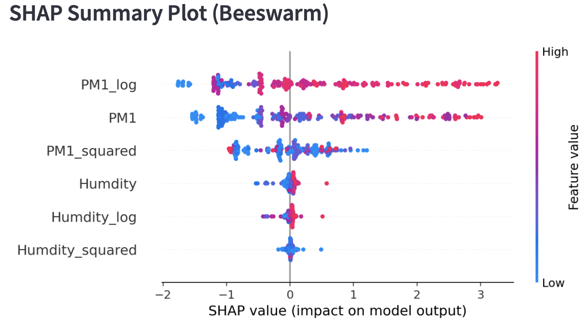
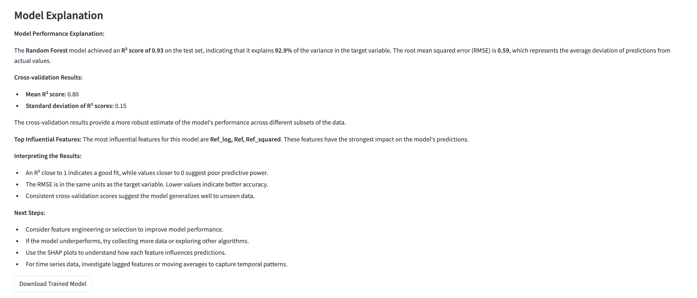
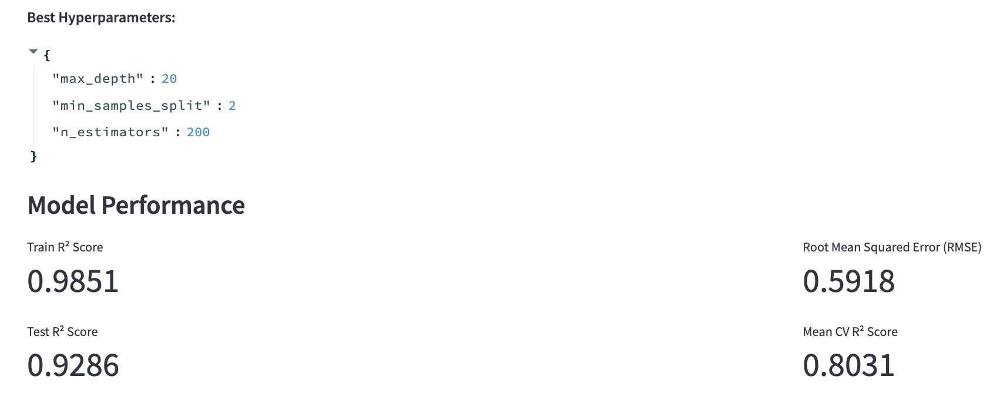
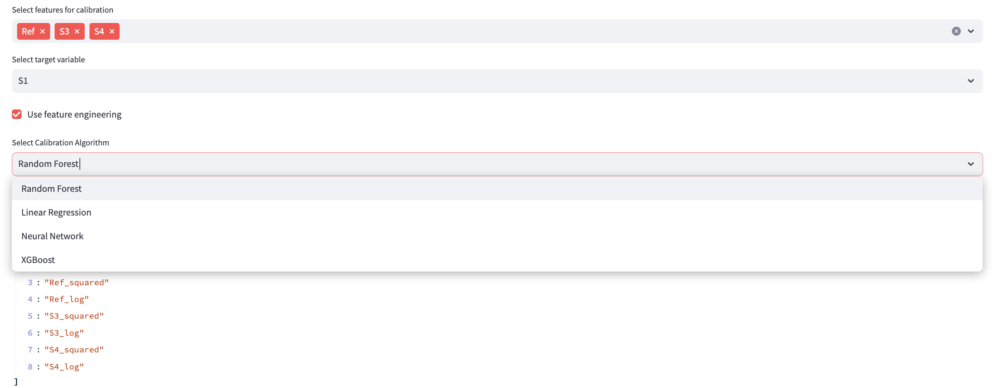
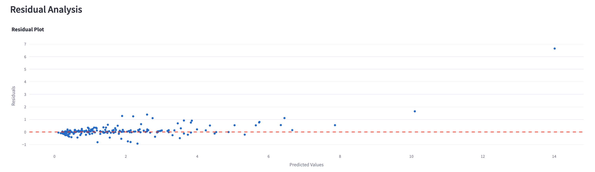

# Low-Cost Sensor Calibration Toolkit

## Overview
This toolkit is a no-code, open-source solution for calibrating low-cost sensors using machine learning techniques with built-in explainability features. It's designed to make the calibration process accessible to users without extensive programming or data science expertise.

## Features
- **Data Ingestion**: Upload and merge multiple CSV files
- **Preprocessing**: Automated handling of missing values and feature normalization
- **Feature Engineering**: Create lag features, rolling statistics, and polynomial features
- **Model Training**: Support for Random Forest, XGBoost, Neural Networks, and Linear Regression
- **Hyperparameter Tuning**: Automated tuning with visualization of results
- **Model Evaluation**: Comprehensive metrics and interactive visualizations
- **Model Comparison**: Side-by-side comparison of multiple models
- **Explainability**: SHAP value analysis for model interpretation

  

- **Model Export**: Save and deploy trained models

## Getting Started
Visit our Streamlit App to start using the toolkit immediately. No installation required!

### Local Installation
To run the toolkit locally:

1. Clone this repository:
    ```bash
    git clone https://github.com/yourusername/low-cost-sensor-calibration.git
    ```

2. Install the required packages:
    ```bash
    pip install -r requirements.txt
    ```

3. Run the Streamlit app:
    ```bash
    streamlit run app.py
    ```

## Usage
1. Upload your sensor data CSV files
   
   
2. Select features and target variable
   

3. Choose model type and configure settings
   

4. Train and evaluate your model
   

5. Explore model explanations and performance metrics
   

6. Export your calibrated model

## License
This project is licensed under the MIT License - see the [LICENSE.md](LICENSE.md) file for details.
